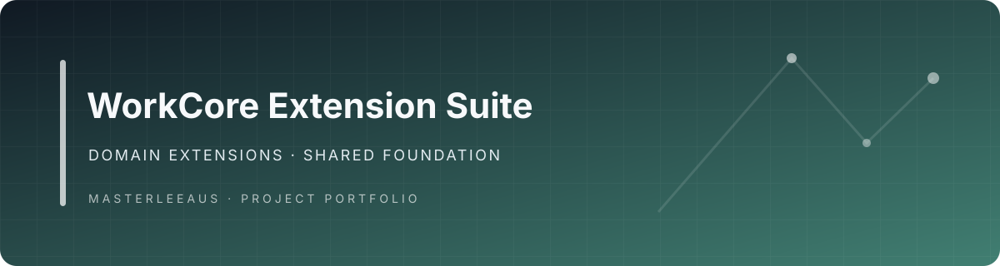

# WorkCore-ERP-Modules — WorkCore Extension Suite

> A deterministic extraction of a modular business platform into six packages—one shared foundation and five domain extensions—with ownership, dependencies, checksums, and governed AI capabilities made explicit.

WorkCore Extension Suite addresses a practical architecture problem: how to separate a large consolidated application into installable domain packages without losing canonical namespaces, historical migrations, tenant boundaries, governed actions, or host integration. The package set is six parts: one mandatory shared foundation plus five domain extensions. The repository packages that extraction as a repeatable build and validation system.

## Why this project matters

A package split is only useful if the result is deterministic and safe to evolve. WorkCore makes the boundary reviewable:

- every source file and internal module has one package owner
- the shared foundation remains the authority for tenancy, permissions, governed actions, read models, Rewind, outbox, host adapters, configuration, and historical migrations
- domain extensions depend on the shared foundation at a matching version
- ownership manifests, package manifests, checksums, and provider patches are generated and validated together
- disabling an extension does not delete operational records, attachments, audit history, offline operations, or Rewind history

## Package architecture

| Package | Responsibility | Owned modules |
|---|---|---|
| workcore-shared-foundation | Tenancy, permissions, governed actions, read models, Rewind, outbox, host adapters, configuration, and historical migrations | Shared system infrastructure |
| workcore-business-network | Customers, CRM, catalogue, support, knowledge, reviews, territories, and intelligence | CRM, Catalogue, Support, Knowledge, KnowledgeBase, Reviews, Territories, Feedback, Wizards |
| workcore-commercial | Finance, payroll, inventory, procurement, vault, and trust accounting | Finance, Payroll, Inventory, Supply, TitanVault, TrustAccounting |
| workcore-work-operations | Jobs, scheduling, dispatch, recurring work, forms, repairs, fleet, and QR operations | Operations, Scheduling, Dispatch, RecurringServices, Forms, Repairs, Fleet, QRCode |
| workcore-property-operations | Premises, assets, documents, and vertical operating profiles | Premises, Assets, Documents |
| workcore-workforce-assurance | Workforce, people, rosters, attendance, compliance, assurance, credentials, and NDIS | Workforce, People, AttendanceVerification, Rosters, Attendance, Compliance, Assurance, Credentials, NDIS |

Every domain extension requires workcore/shared-foundation at the same package version. Canonical App\Domains\WorkCore namespaces remain unchanged during the first extraction phase.

## Deterministic build and verification

The repository contains a small, explicit toolchain for the extraction:

- tools/build_extensions.py rebuilds all six packages and release manifests from a consolidated WorkCore source tree.
- tests/test_build_extensions.py protects extraction boundaries, provider patches, manifests, and deterministic releases.
- tools/validate_repository.py verifies the committed package set, ownership rules, dependencies, and every package checksum.
- integration/host-overlay preserves MagicAI host-integration assets separately from installable package ownership.
- site contains the MiniUp catalogue source; generated download ZIPs are intentionally excluded from Git history.
- docs/superpowers contains the approved design and implementation plan.

The complete file-level ownership and transformation record is in ownership-manifest.json. Transfer integrity is recorded in IMPORT-PROVENANCE.md.

## AI and agent boundary

The extracted source includes a concrete host-facing AI surface in the Business Network package:

- [AgentOrchestrator.php](packages/workcore-business-network/src/Domains/WorkCore/System/AI/Orchestration/AgentOrchestrator.php) enforces company and actor scope, idempotent run replay, bounded steps and tool calls, persisted conversations, memory, and approval pauses.
- [OpenAICompatibleProvider.php](packages/workcore-business-network/src/Domains/WorkCore/System/AI/Providers/OpenAICompatibleProvider.php) normalises model responses, token usage, tool calls, timeouts, and retryable provider failures behind a provider contract.
- [ToolApprovalPolicy.php](packages/workcore-business-network/src/Domains/WorkCore/System/AI/Orchestration/ToolApprovalPolicy.php) blocks critical tools and pauses high-risk or confirmation-required tools before execution.
- [CRMToolRegistry.php](packages/workcore-business-network/src/Domains/WorkCore/System/Modules/CRM/AI/CRMToolRegistry.php) is one domain-tool example; package capabilities are exposed as structured tools while governed WorkCore actions remain the write authority.

This is an extension-suite AI surface, not a claim that live provider credentials, authenticated host workflows, or operational deployment are configured in this repository.

## Non-negotiable architecture rules

- Every source file and internal module has exactly one package owner.
- The shared foundation does not automatically load all optional extension providers.
- Historical migrations remain owned by the shared foundation until clean-install baselines are proven.
- Cross-extension writes use governed actions, contracts, or domain events rather than direct foreign-table writes.
- Package disabling must preserve operational records and history.

## Build from consolidated source

~~~
python tools/build_extensions.py \
  --source /absolute/path/to/consolidated-source \
  --output /absolute/path/to/build-output
~~~

The source directory must contain app/Domains/WorkCore. The builder rejects unknown module assignments and emits deterministic package ZIPs plus a complete ownership manifest.

## Validate the repository

~~~
python -m unittest tests/test_repository_integrity.py -v
python tools/validate_repository.py --repo .
find packages -type f -name '*.php' -print0 | xargs -0 -n1 -P4 php -l
~~~

The final command is a POSIX-shell lint pass. On Windows, use the equivalent PowerShell check:

~~~
Get-ChildItem packages -Recurse -Filter *.php | ForEach-Object { php -l $_.FullName }
~~~

The Python checks are cross-platform.
~~~
~~~

Continuous integration repeats ownership, manifest, checksum, dependency, and PHP syntax checks for every pull request and relevant branch push. The commands above are repository checks; they do not replace host integration or clean-install verification.

## Development workflow

1. Branch from main; never develop directly on main.
2. Change only files owned by the target extension or shared foundation.
3. Update extension.json, composer.json, files.sha256.json, and ownership-manifest.json when ownership or package contents change.
4. Run the full validation commands above.
5. Open a draft pull request and keep it draft until host integration and partial-install tests pass.

## Provenance and current boundary

The historical extraction branch [feature/five-domain-extension-split](../../tree/feature/five-domain-extension-split) is preserved as provenance for merged PR #1, not current workflow guidance. The repository has no repository-level LICENSE file in the reviewed tree; confirm and document the intended license and source attribution before public release.

The suite demonstrates deterministic package ownership and explicit integration boundaries. Production deployment, live provider operations, and host-specific release commissioning remain outside this repository's direct validation claim.
