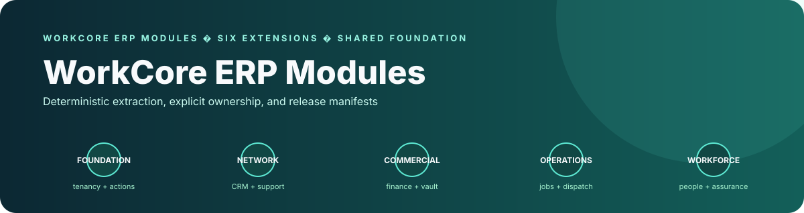

# WorkCore Extension Suite

## Product architecture and engineering highlights

<p align="center">
  
</p>

WorkCore is packaged as five domain extensions on top of one mandatory shared foundation, separating business capabilities from the original consolidated application.

- **Architecture:** A deterministic Python build tool produces packages and release manifests; ownership, dependencies, checksums, provider patches, and host-overlay integration are validated as explicit contracts.
- **Distinctive engineering:** The extraction’s defining feature is single-owner package boundaries: every source file/module belongs to one package, while tenancy, permissions, governed actions, read models, Rewind, outbox, and host adapters stay in the shared foundation.

> **Status: merged extraction baseline.** The five-domain split was merged through [PR #1](../../pull/1), which is now closed and retained as the historical review record. The validation commands below describe checks available in the repository; they do not claim that every host integration or release packaging path is production-ready.

WorkCore has been extracted from the consolidated MagicAI application into **five domain extensions** backed by one mandatory shared foundation. The split preserves the original canonical PHP namespaces, historical data and governed runtime while replacing automatic module fallback-loading with explicit package ownership.

## Packages

| Package | Responsibility | Owned modules |
|---|---|---|
| [`workcore-shared-foundation`](packages/workcore-shared-foundation) | Tenancy, permissions, governed actions, read models, Rewind, outbox, host adapters, configuration and historical migrations | Shared system infrastructure |
| [`workcore-business-network`](packages/workcore-business-network) | Customers, CRM, catalogue, support, knowledge, reviews, territories and intelligence | CRM, Catalogue, Support, Knowledge, KnowledgeBase, Reviews, Territories, Feedback, Wizards |
| [`workcore-commercial`](packages/workcore-commercial) | Finance, payroll, inventory, procurement, vault and trust accounting | Finance, Payroll, Inventory, Supply, TitanVault, TrustAccounting |
| [`workcore-work-operations`](packages/workcore-work-operations) | Jobs, scheduling, dispatch, recurring work, forms, repairs, fleet and QR operations | Operations, Scheduling, Dispatch, RecurringServices, Forms, Repairs, Fleet, QRCode |
| [`workcore-property-operations`](packages/workcore-property-operations) | Premises, assets, documents and vertical operating profiles | Premises, Assets, Documents |
| [`workcore-workforce-assurance`](packages/workcore-workforce-assurance) | Workforce, people, rosters, attendance, compliance, assurance, credentials and NDIS | Workforce, People, AttendanceVerification, Rosters, Attendance, Compliance, Assurance, Credentials, NDIS |

Every domain extension requires `workcore/shared-foundation` at the same package version.

## Repository contents

- [`tools/build_extensions.py`](tools/build_extensions.py) deterministically rebuilds all six packages and release manifests from a consolidated WorkCore source tree.
- [`tests/test_build_extensions.py`](tests/test_build_extensions.py) protects the extraction boundaries, provider patches, manifests and deterministic releases.
- [`tools/validate_repository.py`](tools/validate_repository.py) verifies the committed package set, ownership rules, dependencies and every package checksum.
- [`integration/host-overlay`](integration/host-overlay) preserves MagicAI host-integration assets separately from installable WorkCore package ownership.
- [`site`](site) contains the MiniUp catalogue source; generated download ZIPs are intentionally excluded from Git history.
- [`docs/superpowers`](docs/superpowers) contains the approved design and implementation plan used for this extraction.

## Non-negotiable architecture rules

- Every source file and internal module has exactly one package owner.
- Canonical `App\Domains\WorkCore` namespaces remain unchanged during the first extraction phase.
- The shared foundation does not automatically load all optional extension providers.
- Historical migrations remain owned by the shared foundation until clean-install baselines are proven.
- Disabling or uninstalling an extension must not delete operational records, attachments, audit history, offline operations or Rewind history.
- Cross-extension writes must use governed actions, contracts or domain events rather than direct foreign-table writes.

The complete file-level ownership and transformation record is in [`ownership-manifest.json`](ownership-manifest.json). Transfer integrity is recorded in [`IMPORT-PROVENANCE.md`](IMPORT-PROVENANCE.md).

## AI and agent boundary

The extracted source includes a concrete, host-facing AI surface in the Business Network package:

- `AgentOrchestrator.php` enforces company/actor scope, idempotent run replay, bounded steps/tool calls, persisted conversations, memory, and approval pauses.
- `OpenAICompatibleProvider.php` normalises model responses, token usage, tool calls, timeouts, and retryable provider failures behind a provider contract.
- `ToolApprovalPolicy.php` blocks critical tools and pauses high-risk or confirmation-required tools before execution.
- Domain `*ToolRegistry.php` files expose package capabilities as structured tools; governed WorkCore actions remain the write authority.

These are source-level capabilities in an extension suite. Live provider credentials, host wiring, authenticated workflows, and operational deployment are outside this repository's validation claim.

## Build from the consolidated source

```bash
python tools/build_extensions.py \
  --source /absolute/path/to/consolidated-source \
  --output /absolute/path/to/build-output
```

The source directory must contain `app/Domains/WorkCore`. The builder rejects unknown module assignments and emits deterministic package ZIPs plus a complete ownership manifest.

## Validate the repository

```bash
python -m unittest tests/test_repository_integrity.py -v
python tools/validate_repository.py --repo .
find packages -type f -name '*.php' -print0 | xargs -0 -n1 -P4 php -l
```

Continuous integration repeats the ownership, manifest, checksum, dependency and PHP syntax checks for every pull request and relevant branch push.

## Development workflow

1. Branch from `main`; never develop directly on `main`.
2. Change only files owned by the target extension or shared foundation.
3. Update `extension.json`, `composer.json`, `files.sha256.json` and `ownership-manifest.json` when ownership or package contents change.
4. Run the full validation commands above.
5. Open a draft pull request and keep it draft until host integration and partial-install tests pass.

The historical extraction branch is [`feature/five-domain-extension-split`](../../tree/feature/five-domain-extension-split); it is preserved as provenance for merged PR #1, not current workflow guidance. No repository-level `LICENSE` file was found; confirm and document the intended license and source attribution before public release.
